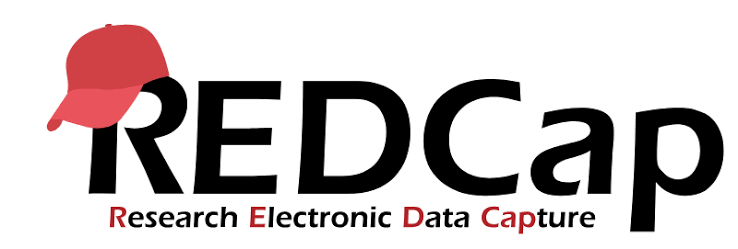

---
format:
  html:
    linkcolor: rgb(0,62,107)
    mainfont: Nunito Sans
---

```{=html}
<style>
.rc-cards {
  display: grid;
  grid-template-columns: repeat(auto-fit, minmax(230px, 1fr));
  gap: 1.25rem;
  margin: 1.5rem 0;
}
.rc-card {
  background: #fff;
  border: 1px solid #e3e8ee;
  border-top: 4px solid rgb(0, 78, 159);
  border-radius: 0.6rem;
  padding: 1.25rem;
  box-shadow: 0 2px 6px rgba(0,0,0,.05);
  transition: transform .2s, box-shadow .2s;
}
.rc-card:hover { transform: translateY(-2px); box-shadow: 0 6px 16px rgba(0,0,0,.1); }
.rc-card h4 { margin-top: .2rem; color: rgb(0, 62, 107); }
.rc-card p  { margin-bottom: 0; font-size: .97rem; }
@media (max-width: 768px) { .rc-cards { grid-template-columns: 1fr; } }
</style>
```

{width="360px" fig-align="center" fig-alt="REDCap logo"}

# REDCap

Open science is built on a foundation of transparency and replicability. One way that we can maintain this in data collection is through standardized data collection tools such as REDCap. REDCap is an online database where researchers can upload their data or have participants complete surveys that are immediately transferred to the database. It is user friendly and reduces the human errors from data entry within an excel sheet!

We are able to increase the replicability of data entry in REDCap through the use of coding. There is a Python Package being developed called [‘rcol’](https://juliuswelzel.github.io/rcol/) that is able to install all instruments a project may need directly into REDCap. This package has many current instruments being used within the RTG 2783 Neuromodulation at the Universität Oldenburg. By use of this package, you are able to upload these instruments directly into your REDCap project. This standardizes the coding scheme, the questions, and the excel exports.

## What REDCap gives you

```{=html}
<div class="rc-cards">
  <div class="rc-card">
    <h4>Standardised instruments</h4>
    <p>Pull validated questionnaires (FAL, EHI, BDI-II, MoCA…) from <code>rcol</code> so every project uses the same schema.</p>
  </div>
  <div class="rc-card">
    <h4>Fewer entry errors</h4>
    <p>Data goes straight into the database with validation, instead of being retyped into a spreadsheet.</p>
  </div>
  <div class="rc-card">
    <h4>Reproducible setup</h4>
    <p>Your project is defined in a short Python script you can version and re-run.</p>
  </div>
  <div class="rc-card">
    <h4>Analysis-ready exports</h4>
    <p>Consistent CSV / API exports drop cleanly into R, SPSS, or Python — and onward toward BIDS.</p>
  </div>
</div>
```

## Research Data Workflow: From Collection to Open Science

Whether data arrives on paper, on a tablet in the lab, or through an online survey, it lands in one standardized project and exports the same way every time.

```{mermaid}
%%| fig-align: center
flowchart LR
    A["Paper forms"] --> D
    B["Tablet / QR survey"] --> D
    C["Online survey"] --> D
    G["rcol templates"] -.->|install instruments| D
    D["<b>REDCap project</b><br/>standardised instruments"] --> E["Clean export<br/>CSV · API"]
    E --> F["<b>BIDS dataset</b><br/>+ EEG / behaviour"]
    classDef src fill:#e6f2fb,stroke:#004e9f,color:#003e6b;
    classDef core fill:#004e9f,stroke:#003e6b,color:#fff;
    classDef out fill:#e5f5ef,stroke:#00a879,color:#12503b;
    class A,B,C src;
    class D core;
    class E,F out;
```

## Redcap consultation hour

The Neurocognitive Psychology Department will be hosting biweekly meetings for implementation and questions around REDCap. During these meetings, you can discuss things like:

- how REDCap may be implemented for your project,
- how to modify the instruments to suit your specific project needs, or
- anything else you may be curious about!

These meetings will be held by Hayden Mayer and Evrim Evirgen. The meetings will be:

::: {.callout-note}
- **Room** — *to be confirmed*
- **Day** — *to be confirmed*
- **Time** — *to be confirmed*
:::

## Curious to learn more?

Here are some helpful resources to establish a solid foundation in both REDCap and the python package:

```{=html}
<div class="rc-cards">
  <div class="rc-card">
    <h4>rcol — Python package</h4>
    <p>Instrument templates and a full setup walkthrough (account, API key, upload, surveys).</p>
    <p><a href="https://juliuswelzel.github.io/rcol/">Instruction page</a></p>
  </div>
  <div class="rc-card">
    <h4>REDCap manual (UOL)</h4>
    <p>Getting started with REDCap at the University of Oldenburg.</p>
    <p><a href="https://uol.de/f/6/Forschungsdatenmanagement/REDCap-Erste_Schritte.pdf">REDCap – Erste Schritte (PDF)</a></p>
  </div>
  <div class="rc-card">
    <h4>REDCap to BIDS</h4>
    <p>Turn REDCap exports into a BIDS <code>participants.tsv</code> / <code>.json</code> dataset.</p>
    <p><a href="https://github.com/JuliusWelzel/redcap2bids">redcap2bids on GitHub</a></p>
  </div>
</div>
```